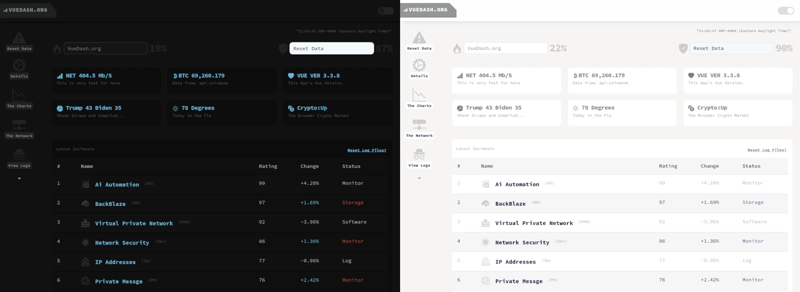

## VueDash
**The initial VueDash.org Vue Dashboard**

This is very much as work in progress.  At this point it is an interesting starting framework for a Vue Dashboard.  It is a Bootstrap CSS styled, component based, Vue3 (Vite) Template.



You can get started with:

```npm run dev```

```npm run build```
		
This dashboard was orginally built to be used with the super simple Node Express backend I created but it does not depend on it as I have added sample data so the widgets show up.  I have left 3rd party api calls in tact where they make sense ( btc price, news headlines, etc. ).

You are welcome to fork it, submit pull requests, etc. but it is early days - there will be breaking changes. 

The pages ( the about page, contact, etc.) use the PageView.vue file in the views folder. It uses userRoute() to handle route.params to direct it to the correct page. The components for pages are in /components/pages 

If you are looking for a specific chart or part of the homepage you best bet is to look at the /components folder. The header and footer are in the layout sub-folder, most of the rest of the components are in the shared and pages sub folders respectively. 

<!-- This is the "clock", but really it's an example of using the useInterval -->
I need a way to have the universal function:
- useInterval is that function /src/js/useInterval
- want a way to have a global pulse the way dop downs has a pulse...
- figure out a way to do dark mode and light mode charts...
- choose list of approved / suggested 3rd party API's